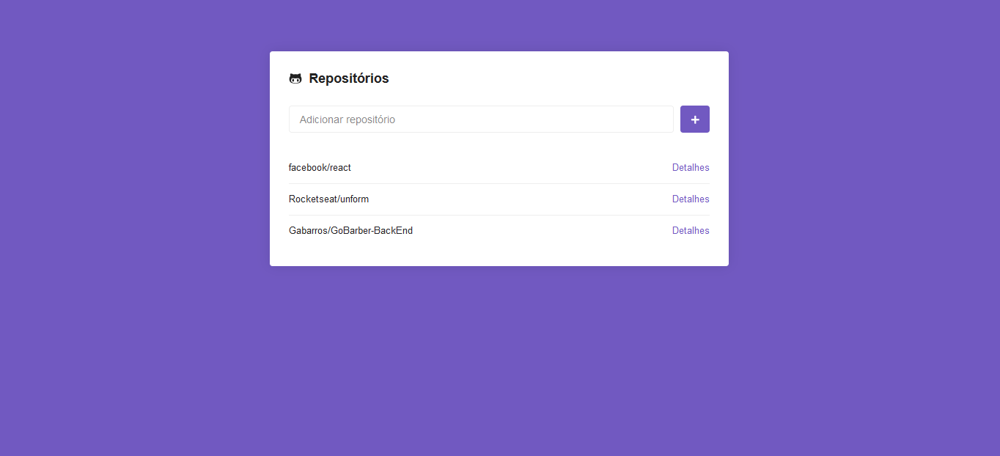
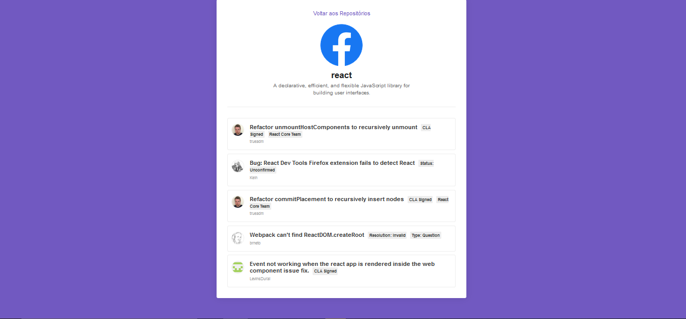

This project was bootstrapped with [Create React App](https://github.com/facebook/create-react-app).

This is a React application where you can add your favorites github repositories in a list, after that you can show the issues of every repository in your favorites list and select which Issue you want to help to solve.

You can use the application cloning the repository and using 'yarn start'

### `yarn start`

Runs the app in the development mode. 
Open [http://localhost:3000](http://localhost:3000) to view it in the browser.

The page will reload if you make edits. 
You will also see any lint errors in the console.
